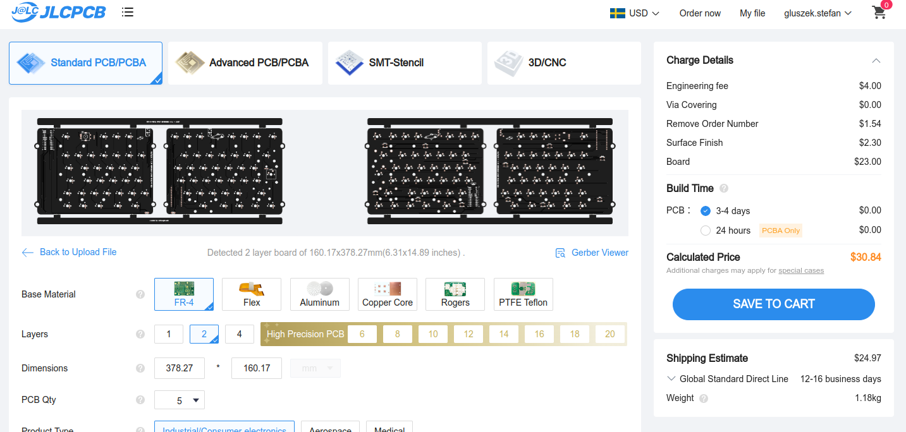
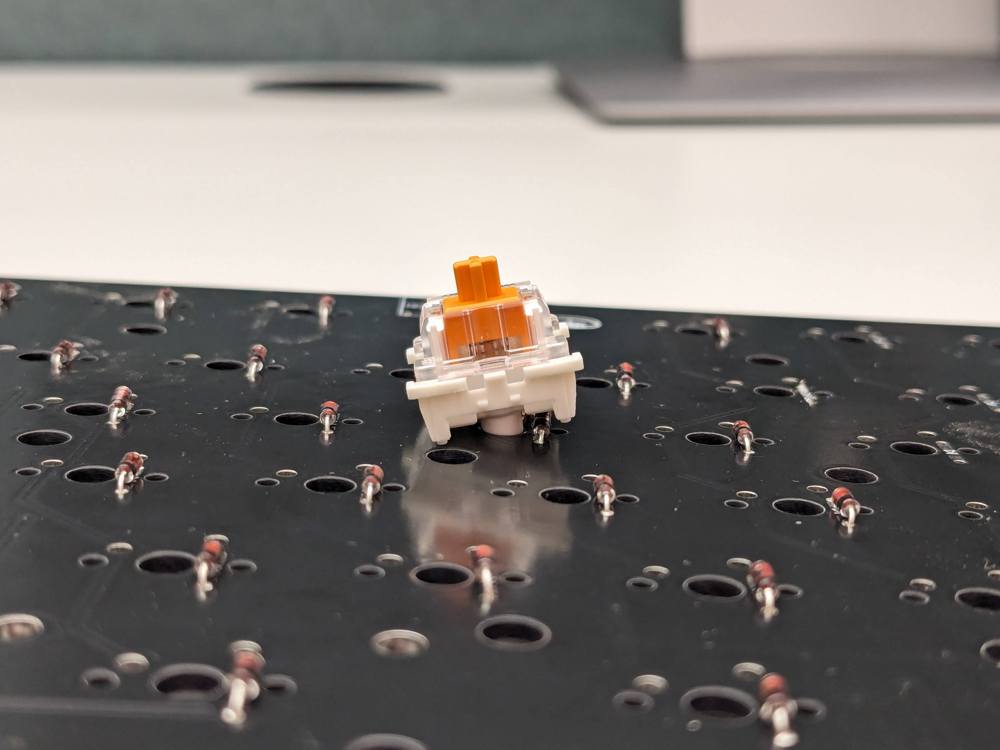

# fat-o-tesa

## Introduction
This repository documents my attempt at building a custom mechanical keyboard. I have been considering switching to a split ergonomic keyboard such as the [Ergodox](https://ergodox-ez.com/) for a while now.
I hesitated, mostly because I love my current Varmillo Mechanical keyboard and I was not sure if switching back and forth between the two would be a good idea. At the end I decided it was more about learning the process of building a custom keyboard than actually using it. So I decided to design and build my own custom mechanical keyboard.

The requirements I had were simple, a split mechanical keyboard with the base layout as close to the ISO layout as possible to make switching back and forth as painless as possible. Why ISO? Because I use a Swedish/Norwegian keyboard which uses the ISO layout.

## The layout
I used the [Keyboard Layout Editor](http://www.keyboard-layout-editor.com/) to create the layout. It's based on the ISO 60% preset, but includes the top row with a couple of functional keys. I will explain why I needed the top row later on when we get to the PCB design.

The raw layout can be found [here](layouts/layout.kle).

## Plate and the PCB
I decided to go with the sandwich design, which means that the top plate, the PCB and the bottom plate will share the same outline.
The top and the bottom plates I can cut out of 3mm acrylic with the laser cutter. I could also manufacture the PCB myself, but the PCB CNC machine at the MakersLink is not ready for general use so I've decided to design the PCB in KiCAD and order it from [JLCPCB](https://jlcpcb.com/), which seems to be pretty affordable (~20USD with shipping). Because the PCB will be manufactured by a third party I've decided to base the entire design on the PCB, as I won't be able to easily modify that, and later export the PCB layout and import into [Onshape](https://cad.onshape.com) for the plates design.

In KiCAD I set the grid to 1/8 * 19.05mm and layed out all the switches on the PCB. One have to be extremely precise when placing the switches and make sure you use all the components using the "Move with reference" option, to make sure all switches are perfectly aligned.
Once I was happy with the placement of the switches on the PCB, I exported the keycaps layout to a DXF file and imported it into Onshape. In Onshape I added some constraints to makes sure, the switches were perfectly aligned. If you miss anything by even as little as 0.01mm the constraints will give you an error and you will have to go back to KiCAD and fix it. Yes, I've learned that the hard way. Once I had the keycaps outlined in Onshape, I started to place the switch cutouts. After testing different cutout options on a 3mm acrylic, I've decided to use 13.8mm x 13.8mm classic MX cutouts with no fillets and no slots for opening the switches. These cutouts resulted in the snuggest fit of the OUTEMU switches to a 3mm acrylic plate. At this point I had a KiCAD PCB design, PCB and plate CAD models in Onshape.

Link to the Onshape document: [fat-o-tesa-v1](https://cad.onshape.com/documents/4cd495c87c7dda10663811d2/w/b5d95b47f52db33ad3f41531/e/3e70d648d0571f67e1f8d256?renderMode=0&uiState=657f0b6864fd316c9ab080da)

I exported the PCB outline from Onshape and imported it as Edge cuts into KiCAD. After wiring everything up the PCB design is ready for manufacturing.

I will wait for all the components to arrive to confirm the footprint dimensions before I order the PCBs from JLCPCB. I also need to add cutouts for the stabilisers, but I haven't received them yet, so I am not sure what the dimensions are.

## PCB footprints review and ordering
All components have arrived and I've reviewed the footprints to make sure they match the PCB design. I have also re-done the traces and made the power delivery (ground and VCC) much thicker (1mm).
I think the PCB is ready for manufacturing. I've generated the fabrication files with [KiJLC](https://github.com/fullyautomated/KiJLC) and uploaded them to (jlcpcb.com)[https://jlcpcb.com/].

## Assembly

The PCB from JLCPCB has arrived! It's time for the assembly.

## v0.1 - That ain't gonna work

OK, that didn't work 🙈. Time for revision.

### Must fix
- [ ] Move the diodes out of the way of the switches
- [ ] Make sure I have all 3D models available in KiCAD to avoid surprises
- [ ] Connect the filled planes to ground and VCC

### Improvements
- [ ] 4 layer PCB stackup to [achieve proper grounding](https://www.youtube.com/watch?v=ySuUZEjARPY). (+$46)
- [ ] PCB with assembled rp2040 MCU (+$100)
- [ ] Hot swap sockets (+$20)
